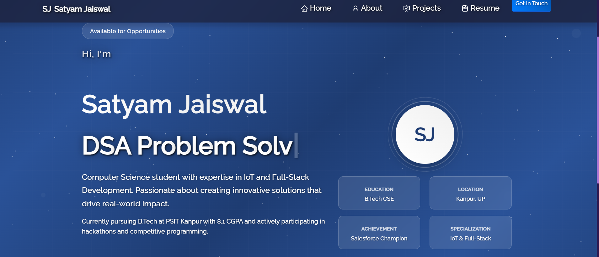

# 🚀 Satyam Jaiswal - Portfolio Website

  

 

 &nbsp;
 &nbsp;

## 👨‍💻 About Me

I'm **Satyam Jaiswal**, a Computer Science student specializing in IoT and Full-Stack Development. Currently pursuing B.Tech at PSIT Kanpur with a CGPA of 8.1/10.

### 🏆 Achievements
- **Salesforce AgentBlazer Champion**
- **300+ DSA Problems** solved
- **5+ Hackathons** participated
- **3+ Projects** completed

## 🛠️ Built With

This portfolio was built using modern web technologies:

- **React.js** - Frontend framework
- **React Bootstrap** - UI components
- **CSS3** - Custom styling
- **React Router** - Navigation
- **React Icons** - Icon library
- **Typewriter Effect** - Animated text
- **Particles.js** - Background effects

## 🚀 Features

- **📱 Fully Responsive** - Works on all devices
- **🎨 Modern Design** - Professional and clean UI
- **⚡ Fast Performance** - Optimized for speed
- **🔗 Easy Navigation** - Smooth page transitions
- **📄 Multiple Sections** - Home, About, Projects, Resume

## 📋 Sections

1. **🏠 Home** - Introduction and quick stats
2. **👤 About** - Personal information and journey
3. **💼 Projects** - Showcase of my work
4. **📄 Resume** - Professional experience and skills

## 🚀 Getting Started

### Prerequisites
- Node.js (v14 or higher)
- npm or yarn

### Installation

1. **Clone the repository**
   
bash
   git clone https://github.com/Satyam1042716/portfolio.git
   cd portfolio

2. **Install dependencies**
   
bash
   npm install

3. **Start development server**
   
bash
   npm start

4. **Open in browser**
   
http://localhost:300

## 📦 Build for Production

bash
npm run build

## 🌐 Deployment

This portfolio is live at:  
🔗 [https://satyam-1042.netlify.app/](https://satyam-1042.netlify.app/)

## 📞 Contact

- **LinkedIn**: [Satyam Jaiswal](https://linkedin.com/in/satyam-jaiswal-15489a259)
- **GitHub**: [Satyam1042716](https://github.com/Satyam1042716)
- **Email**: [Your Email]

## 📄 License

This project is open source and available under the [MIT License](LICENSE).

---

  Made with ❤️ by Satyam Jaiswal

